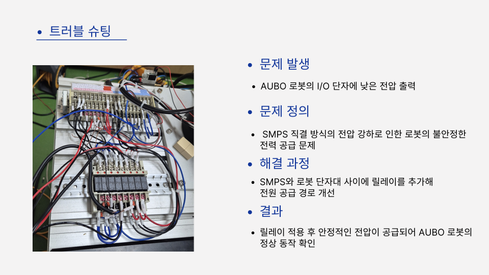

# 🤖 협동로봇 스마트 생산 시스템 구축 프로젝트

경기인력개발원 [스마트로봇엔지니어] 과정 중 진행한 협동로봇 기반 스마트 생산 시스템 프로젝트입니다.  
**단순 반복 작업은 로봇에게, 핵심 역량은 작업자에게!**  

> 📅 기간: 2025년 5월 28 ~ 6월 27일  
> 👥 팀원: 성**(조장), 김**, 김명지(pmhyang69@naver.com), 유**, 정**, 정**  
---

## 🧠 프로젝트 개요

- **문제 인식:** 산업 현장에서 반복 작업과 고령화로 인한 작업자 부상 위험 증가
- **해결 방법:** 협동로봇을 활용하여 Pick & Place / Drilling / Sorting 등 반복 작업 자동화
- **기대 효과:**
  - 작업자 부담 경감
  - 공정 유연성 확보
  - 생산성 향상 및 자동화 효율성 증가

>예시

  

---

## 📍 공정 레이아웃

  

---

## 🧰 프로젝트 구성

### 📦 공정 구성

| 공정 | 설명 |
|------|------|
| **Pick & Place** | 로봇이 제품을 집고 센싱을 합니다. 금속 & 근접 센서가 부품을 감지하면 로봇이 가공단계로 부품을 이동합니다. |
| **Drilling & Tapping** | 반사센서를 이용해 부품이 정위치에 놓였는지 감지 후, 드릴링 머신으로 정밀하게 구멍을 가공합니다. |
| **Sorting** | QR 스캐너로 제품 정보를 인식하여 정보별로 구분합니다. |

---

### 🧪 공정별 실습 & 시연

#### 🔹 Pick & Place

  

> 작업순서

  

  

- 공정 선택, 수동 조작, 설정, 알람, 통계 메뉴 등으로 구성
- 직관적인 아이콘 기반 UI와 실시간 센서 I/O 모니터링 제공

> 공정컨셉

  

---

#### 🔹 Drilling & Tapping

  

> 작업순서

  

> 공정컨셉

  

---

#### 🔹 Sorting

  

> 작업순서

  

> 공정컨셉

---

### 🎛️ HMI 화면 구성

- 공정 선택, 수동 조작, 설정, 알람, 통계 메뉴 등으로 구성
- 직관적인 아이콘 기반 UI와 실시간 센서 I/O 모니터링 제공

  
  

---

### 🔌 전장 설계

- PLC 기반 전장 시스템 설계 (EPLAN 사용)
- 입력/출력 단자 설계
- CC-Link를 통한 각 공정 간 통신

  
  

---

## 🛠️ 트러블슈팅 사례

| 문제 | 원인 | 해결 방법 |
|------|------|-----------|
| 로봇 동작에 불필요한 동선  가공물 그립 불량 | 각 웨이포인트별 불필요한 관절 움직임  그리퍼 구조 설계 문제 | 관절 1, 5 위주로 재티칭 지면과 30도 각도를 형성하는 그리퍼 설계 (그립부 고무패드 부착) |
| 실린더가 앞동작 완료 전 작동  오토스위치 출력 불량 | 앞동작 조건과 무관하게 실린더 작동하는 제어 래더도  3선식 오토스위치 노후 | 실린더 동작 전 인터락 조건 걸어줌 2선식 스위치로 교체 후 배선 수정 |
| AUBO I/O 출력 불안정 | SMPS 직결 방식의 전압 강하 | 릴레이 및 커패시터 추가하여 회로 안정화 |

### 📸 트러블슈팅 사진  

#### 🔹 로봇 관절 회전 이상  

#### 🟥 문제 발생 시 동작

---

#### 🛠 해결 과정

---

#### ✅ 재티칭 후 정상 동작

#### 🔹 공압실린더 문제

  
  

#### 🔹 AUBO I/O 출력 불안정

  

---

## 📹 프로젝트 시연

### 금속 부품 공정

  

### 플라스틱 부품 공정 (전체공정)

<i>▲ 클릭하면 유튜브에서 전체 시연 영상 확인 가능</i>

---

## 📆 작업 히스토리

1. 아이디어 회의 및 역할 분담  
2. 공정 설계 → 시뮬레이션  
3. EPLAN 회로 설계  
4. PLC 래더 로직 구현  
5. AUBO 로봇 티칭 및 테스트  
6. HMI 화면 구성  
7. 통합 테스트 및 디버깅  

> 전체 프로젝트는 약 3주 동안 진행되었습니다.

---

## 📁 관련 자료

- ⬇️ [PPT 다운로드](https://drive.google.com/file/d/10VLDqtUj8IR8bCqBM0PCQGoHin-mNEku/view?usp=drive_link)  
- ⬇️ [PDF 다운로드](https://drive.google.com/file/d/1W1ioYrZPGSz_rGT-2M3yWMqzUfSnEWWX/view?usp=drive_link)

---

## 🔚 마무리

> 이 프로젝트를 통해 협동로봇의 실무 적용 가능성과 자동화 설계 전 과정을 체험할 수 있었습니다.  
> 로봇 제어, 센서 회로, 전장 설계, 티칭, HMI까지 연계된 경험은 현장 중심의 성장 기회였습니다.  
> 감사합니다.

---

